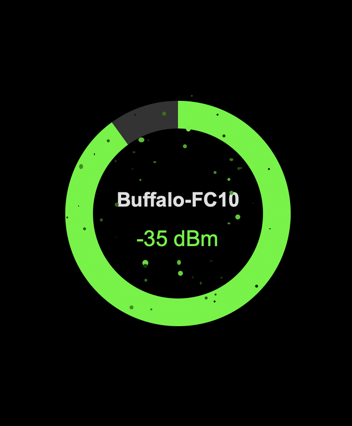

# Signal Tracker

[🇯🇵 日本語](./README_ja.md) | 🇺🇸 English

<table>
  <tr>
    <td></td>
    <td></td>
  </tr>
</table>

**Signal Tracker** is a macOS desktop application that visualizes your current Wi-Fi signal strength using dynamic animations.

## ✨ Features

- **Real-time Wi-Fi monitoring**: Detects Wi-Fi signal strength using macOS's CoreWLAN framework
- **Dynamic visual feedback**: Animations that vary based on signal strength levels
- **Lightweight design**: Optimized UI application packaged with PyInstaller
- **Native macOS integration**: Built specifically for macOS using Apple's official frameworks

## 🚀 Installation

### Quick Installation (Recommended)

Run the following command in your terminal for a quick and easy installation:

```bash
curl -sL https://raw.githubusercontent.com/j341nono/SignalSurfer/main/install.sh | bash
```

### Manual Installation

Alternatively, you can clone the repository and build the app manually:

```bash
# Clone the repository
git clone git@github.com:j341nono/SignalSurfer.git
cd SignalSurfer

# Set up the environment
uv sync
source .venv/bin/activate

# Build the application
pyinstaller --onefile --windowed --name="WiFi Signal Visualizer" --icon=assets/app.icns src/__main__.py

# Clean up
deactivate
```

**Requirements**: Python 3.8+ and PyInstaller

## 💻 Usage

After building the application:

1. Navigate to the `dist/` directory
2. Double-click on **WiFi Signal Visualizer** to launch the app
3. The app will automatically start monitoring your Wi-Fi signal strength
4. Visual feedback will update in real-time based on your signal quality

## 🛠️ Technologies Used for Wi-Fi Information Retrieval

Several methods are available for retrieving Wi-Fi information such as SSID and RSSI on macOS. Here's our evaluation:

### airport Command-Line Tool (❌ Deprecated)

The `airport` tool is a command-line utility that provides detailed Wi-Fi information.

**Pros:**
- Easy to use via terminal or subprocess calls
- Provides detailed and structured information

**Cons:**
- Deprecated by Apple and may be removed in future macOS releases
- Not officially supported or documented
- Inconsistent behavior across OS versions

**Decision:** Rejected due to deprecation status and lack of future support.

### Wireless Diagnostics (wdutil) (⚠️ Limited Use)

The `wdutil` command is the official command-line interface for Wireless Diagnostics.

**Pros:**
- Officially provided by Apple
- Offers comprehensive diagnostics and Wi-Fi environment info

**Cons:**
- Requires `sudo` for most commands
- Not script-friendly due to privilege escalation
- Available only on recent macOS versions (Monterey and later)

**Decision:** Partially rejected due to sudo requirements limiting GUI application use.

### CoreWLAN Framework (✅ Selected)

CoreWLAN is a native macOS framework for direct Wi-Fi interface access.

**Pros:**
- Fully supported and documented API by Apple
- No need for `sudo` or terminal-based workarounds
- Compatible with GUI applications and scripting
- Returns structured Wi-Fi information (SSID, RSSI, BSSID, etc.)

**Cons:**
- Requires use of Objective-C, Swift, or PyObjC (Python bridge)

**Decision:** Selected for being secure, stable, and future-proof without requiring elevated privileges.

## 🤝 Contributing

Contributions are welcome! Please feel free to submit a Pull Request.

## 📄 License

This project is open source. Please check the LICENSE file for more details.

## 🐛 Issues

If you encounter any problems or have suggestions, please [create an issue](https://github.com/j341nono/SignalSurfer/issues) on GitHub.