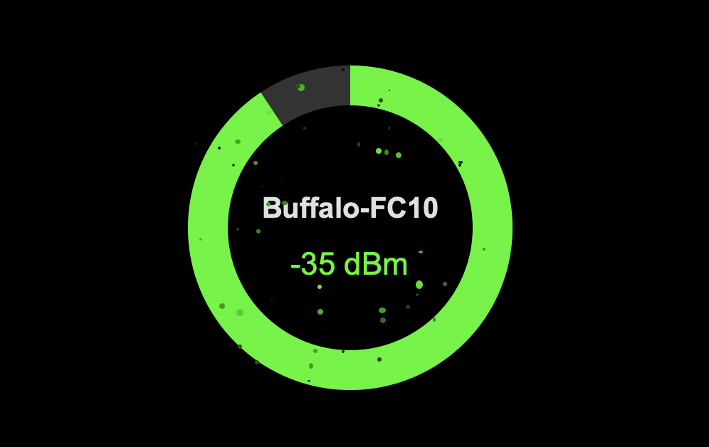

# Signal Tracker

🇯🇵 日本語 | [🇺🇸 English](./README.md)

<table>
  <tr>
    <td></td>
    <td></td>
  </tr>
</table>

**Signal Tracker** は、現在のWi-Fi信号強度を動的なアニメーションで視覚化するmacOSデスクトップアプリケーションです。

## ✨ 機能

- **リアルタイムWi-Fi監視**: macOSのCoreWLANフレームワークを使用してWi-Fi信号強度を検出
- **動的視覚フィードバック**: 信号強度レベルに基づいて変化するアニメーション
- **軽量設計**: PyInstallerでパッケージ化された最適化されたUIアプリケーション
- **ネイティブmacOS統合**: Appleの公式フレームワークを使用してmacOS専用に構築

## 🚀 インストール

### クイックインストール（推奨）

ターミナルで以下のコマンドを実行して、簡単にインストールできます：

```bash
curl -sL https://raw.githubusercontent.com/j341nono/SignalSurfer/main/install.sh | bash
```

### 手動インストール

リポジトリをクローンしてアプリを手動でビルドすることもできます：

```bash
# リポジトリをクローン
git clone git@github.com:j341nono/SignalSurfer.git
cd SignalSurfer

# 環境をセットアップ
uv sync
source .venv/bin/activate

# アプリケーションをビルド
pyinstaller --onefile --windowed --name="WiFi Signal Visualizer" --icon=assets/app.icns src/__main__.py

# クリーンアップ
deactivate
```

**必要条件**: Python 3.8+ と PyInstaller

## 💻 使用方法

アプリケーションをビルドした後：

1. `dist/` ディレクトリに移動
2. **WiFi Signal Visualizer** をダブルクリックしてアプリを起動
3. アプリが自動的にWi-Fi信号強度の監視を開始します
4. 信号品質に基づいてリアルタイムで視覚的フィードバックが更新されます

## 🛠️ Wi-Fi情報取得に使用された技術

macOSでSSIDやRSSIなどのWi-Fi情報を取得する方法はいくつかあります。以下が評価結果です：

### airport コマンドラインツール（❌ 非推奨）

`airport` ツールは、詳細なWi-Fi情報を提供するコマンドラインユーティリティです。

**メリット:**
- ターミナルやサブプロセス呼び出しで使いやすい
- 詳細で構造化された情報を提供

**デメリット:**
- Appleにより非推奨とされ、将来のmacOSリリースで削除される可能性
- 公式にサポートされておらず、文書化もされていない
- OSバージョン間で動作に一貫性がない

**判断:** 非推奨ステータスと将来のサポート不足により却下。

### Wireless Diagnostics (wdutil)（⚠️ 制限付き使用）

`wdutil` コマンドは、Wireless Diagnosticsの公式コマンドラインインターフェースです。

**メリット:**
- Appleが公式に提供
- 包括的な診断とWi-Fi環境情報を提供

**デメリット:**
- ほとんどのコマンドで `sudo` が必要
- 権限昇格のためスクリプトフレンドリーでない
- 最近のmacOSバージョン（Monterey以降）でのみ利用可能

**判断:** sudo要件がGUIアプリケーションの使用を制限するため部分的に却下。

### CoreWLANフレームワーク（✅ 選択）

CoreWLANは、Wi-Fiインターフェースに直接アクセスするためのネイティブmacOSフレームワークです。

**メリット:**
- Appleによる完全にサポートされ文書化されたAPI
- `sudo` やターミナルベースの回避策が不要
- GUIアプリケーションとスクリプティングに対応
- 構造化されたWi-Fi情報（SSID、RSSI、BSSIDなど）を返す

**デメリット:**
- Objective-C、Swift、またはPyObjC（Pythonブリッジ）の使用が必要

**判断:** 権限昇格を必要とせず、安全で安定した将来性のある選択として選定。

## 🤝 コントリビューション

コントリビューションを歓迎します！プルリクエストをお気軽に送信してください。

## 📄 ライセンス

このプロジェクトはオープンソースです。詳細についてはLICENSEファイルを確認してください。

## 🐛 問題報告

問題が発生したり提案がある場合は、GitHubで[イシューを作成](https://github.com/j341nono/SignalSurfer/issues)してください。